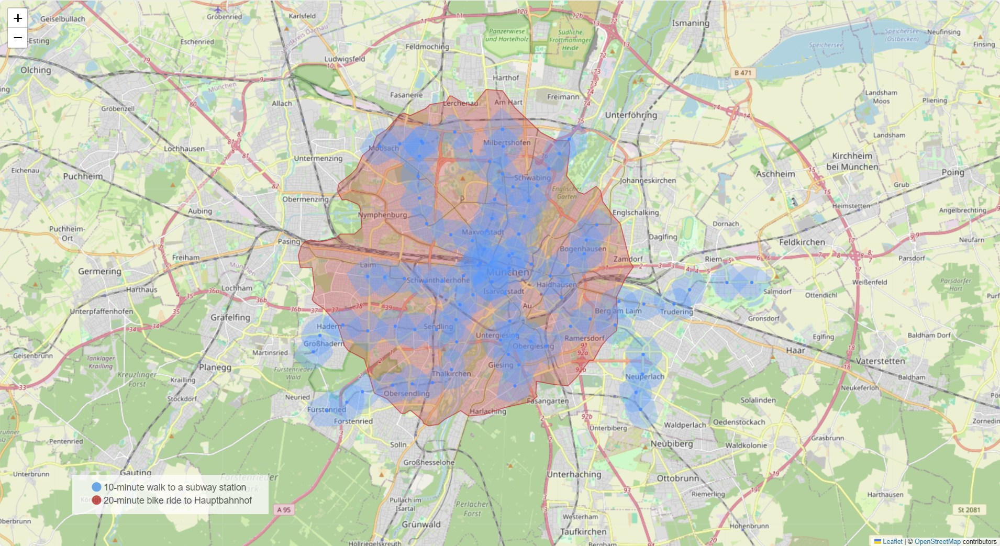

# 🗺️ The Munich Flat Hack

[](https://www.python.org/downloads/)
[](https://openrouteservice.org/)

## 🎯 Project Overview

**Flat hunting in Munich made easy using geospatial analysis.**

The tool uses OpenRouteService isochrones to identify areas of the city that meet specific location criteria. For me it was important to be well connected to public transport - my criteria was:

- **🚶‍♂️ Walking**: Within 10 minutes of a subway station
- **🚲 Cycling**: Within 20 minutes to Munich Hauptbahnhof

### Customization

The code can be adjusted to show other areas within a given distance from other points of interest, such as:

- **🏫 Schools**, e.g. a 15-minute drive from a school
- **🛒 Groceries**, e.g. a 5-minute walk from a supermarket
- **🏢 Your office**, e.g. 30-minute commute with public transport to your office

Feel free to modify the code to suit your needs!

## 🛠️ Tech Stack

- **OpenRouteService API**: Isochrone calculations
- **OpenStreetMap**: Base map data
- **Folium**: Interactive map visualization
- **Python**: Data processing

## 📁 Structure

```bash
├── config.py           # API key for OpenRouteService (not included)
├── constants.py                # Script constants
├── create_isochrones_map.py    # Main script
├── helpers.py                  # Helper functions
└── maps/                       # Output directory for maps
    └── isochrones_map.html
```

## 🚀 Getting Started

### Prerequisites

```bash
python -m venv venv
.\venv\Scripts\activate
pip install -r requirements.txt
```

### Configuration
1. Get API key from [OpenRouteService](https://api.openrouteservice.org/)
2. Create `config.py`: `API_KEY = 'your_api_key_here'`
3. Get your own coordinates' box from [bboxfinder](https://bboxfinder.com/) (optional)
4. Define a new coordinates' box and other parameters in `constants.py`

### Run
```bash
python create_isochrones_map.py
```

## 🗺️ Output
The script generates an interactive map showing:

- 🔵 10-minute walking radius (blue)
- 🔴 20-minute cycling radius (red)
- 🚇 Munich subway stations



---
_Built with ❤️ in Munich_